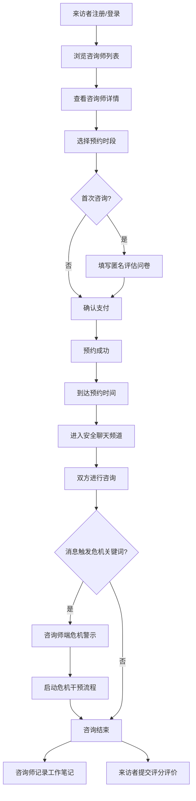

## 1. 产品概述

在线心理咨询预约与档案管理平台，连接专业心理咨询师与有心理援助需求的来访者，提供安全、私密、专业的在线咨询服务。平台聚焦保护来访者隐私安全，同时为咨询师提供高效的档案管理与执业工具。

- 解决痛点：心理咨询行业信息不对称、隐私泄露风险、咨询记录管理混乱
- 目标用户：执业心理咨询师、有心理咨询需求的来访者
- 核心价值：安全私密的沟通环境、专业匹配的预约系统、完善的档案管理

## 2. 核心功能

### 2.1 用户角色

| 角色 | 注册方式 | 核心权限 |
|------|----------|----------|
| 来访者 | 手机号/邮箱注册 | 浏览咨询师、预约咨询、填写问卷、参与咨询、购买课程包、评价 |
| 咨询师 | 资质审核注册 | 完善执业信息、设置时段价格、接收预约、参与咨询、记录档案、启动危机干预 |

### 2.2 功能模块

1. **首页/咨询师列表页**：咨询师展示卡片、筛选器（擅长方向/服务形式/价格）、排序
2. **咨询师详情页**：个人介绍、擅长领域、真实评价、可预约时段、课程包
3. **预约流程页**：时段选择、问卷填写、预约确认
4. **咨询会话页**：安全聊天频道（文字/语音/视频入口）、危机检测提示
5. **咨询师后台**：执业信息管理、时段设置、预约管理、来访者档案
6. **来访者中心**：我的预约、课程包管理、评价管理
7. **认证登录页**：双角色登录注册

### 2.3 页面详情

| 页面名称 | 模块名称 | 功能描述 |
|----------|----------|----------|
| 首页 | 导航栏 | Logo、角色切换入口、登录/注册按钮 |
| 首页 | Hero区域 | 平台价值观展示、搜索框、快速筛选标签 |
| 首页 | 咨询师列表 | 卡片式展示、头像、姓名、擅长标签、评分、价格、在线状态 |
| 首页 | 筛选面板 | 按擅长方向（焦虑/抑郁/婚姻/青少年）、服务形式（文字/语音/视频）、价格区间筛选 |
| 咨询师详情页 | 头部信息 | 头像、姓名、执业资质徽章、从业年限、评分统计 |
| 咨询师详情页 | 个人简介 | 教育背景、培训经历、咨询理念 |
| 咨询师详情页 | 擅长领域 | 标签化展示擅长方向与服务形式 |
| 咨询师详情页 | 评价区 | 仅显示评分数值（1-5星）、评价数量、分布统计，不显示文字内容 |
| 咨询师详情页 | 预约时段 | 周视图日历、可预约时间段、单次咨询价格 |
| 咨询师详情页 | 课程包 | 6次/12次课程包展示、优惠价格、购买入口 |
| 预约流程页 | 时段确认 | 显示所选咨询师、日期时间、服务形式、价格 |
| 预约流程页 | 匿名评估问卷 | 首次咨询前填写：情绪状态、困扰程度、既往史等（仅咨询师可见） |
| 预约流程页 | 支付确认 | 订单信息、支付方式 |
| 咨询会话页 | 消息区域 | 实时聊天界面、文字消息、语音/视频通话按钮、消息加密标识 |
| 咨询会话页 | 危机提示条 | 触发关键词时顶部红色警示条，咨询师端显示"启动危机干预流程"按钮 |
| 咨询会话页 | 会话信息 | 剩余时长、结束咨询按钮 |
| 咨询师后台 | 执业信息 | 执业证号上传、擅长方向设置、服务形式、个人介绍编辑 |
| 咨询师后台 | 时段管理 | 每周可预约时段设置、休息日标记、单次时长设置 |
| 咨询师后台 | 预约列表 | 待确认/已确认/已完成预约状态管理 |
| 咨询师后台 | 档案管理 | 来访者列表、个案工作笔记（富文本）、咨询历程时间线 |
| 来访者中心 | 我的预约 | 即将到来/历史预约、取消预约 |
| 来访者中心 | 课程包 | 已购课程包、剩余次数、使用记录 |
| 来访者中心 | 评价 | 待评价咨询、提交评分 |

## 3. 核心流程

### 来访者预约咨询流程
来访者进入首页 → 筛选浏览咨询师 → 查看咨询师详情与评价 → 选择预约时段 → 首次咨询填写匿名评估问卷 → 确认支付 → 预约成功通知 → 到点进入安全频道咨询 → 结束后提交评分评价

### 咨询师执业流程
咨询师注册并提交执业资质 → 平台审核通过 → 完善执业信息（擅长/服务形式/介绍）→ 设置每周可预约时段与价格 → 接收来访者预约 → 确认预约 → 查看匿名评估问卷 → 到点进入安全频道 → 消息触发危机关键词时启动干预 → 结束后记录工作笔记 → 查看来访者评分

### 危机干预流程
来访者发送消息 → 系统实时关键词检测 → 命中预设关键词 → 咨询师端弹出危机警示 → 咨询师点击启动危机干预 → 系统记录干预标记 → 咨询师按流程引导处理

## 4. 用户界面设计

### 4.1 设计风格
- **主色调**：深青色 #0F766E（信任、专业、平静）+ 暖橙色 #F97316（关怀、温暖）
- **辅助色**：翡翠绿 #10B981（安全、通过）+ 玫瑰红 #F43F5E（危机警示）
- **中性色**：石板灰系列（slate-50 至 slate-900），营造专业稳重感
- **按钮风格**：圆角 10px，主色填充按钮带微阴影，hover 时轻微上浮 + 阴影加深
- **字体**：标题使用 "Noto Serif SC"（衬线体，专业感），正文使用 "Noto Sans SC"（无衬线体，易读性）
- **布局风格**：卡片式布局，柔和阴影， generous padding，充足留白
- **图标**：Lucide React 线性图标，统一 20px 尺寸
- **质感**：浅暖灰色背景 + 白色卡片 + 微妙渐变点缀，传递温暖安全的氛围

### 4.2 页面设计概述

| 页面名称 | 模块名称 | UI元素 |
|----------|----------|--------|
| 首页 | Hero区域 | 大标题衬线字体、温暖渐变背景、搜索框内嵌图标、快速筛选胶囊按钮 |
| 首页 | 咨询师卡片 | 头像圆形边框（2px主色）、姓名加粗、资质徽章（渐变背景）、擅长标签胶囊、评分星星、价格突出显示 |
| 咨询师详情页 | 头部信息 | 大头像、姓名+资质徽章同行、从业年限+咨询人次统计、评分概览进度条 |
| 咨询师详情页 | 时段日历 | 周切换按钮、日期卡片（可选/已约/已满状态色）、时段网格按钮 |
| 咨询会话页 | 消息区域 | 深浅气泡区分双方、消息加密锁图标、危机警示红色条带动画、输入框工具栏 |
| 咨询师后台 | 档案区 | 来访者卡片列表、工作笔记富文本编辑器、时间线节点样式 |

### 4.3 响应式
- Desktop-first 设计，主内容区最大宽度 1280px 居中
- 平板端（768px-1024px）：侧边栏折叠为抽屉，卡片两列布局
- 移动端（<768px）：单列布局，底部 Tab 导航，聊天界面全屏
- 所有交互元素触摸区域 ≥ 44px

### 4.4 动效设计
- 页面加载：主内容区域淡入上滑（stagger 50ms）
- 咨询师卡片：hover 时 translateY(-4px) + shadow-lg 过渡
- 危机警示：红色警示条 slide-down + pulse 呼吸动画
- 聊天消息：逐条淡入滑入，己方右侧进入，对方左侧进入
- 按钮交互：transform scale(0.98) active 态，150ms 过渡
