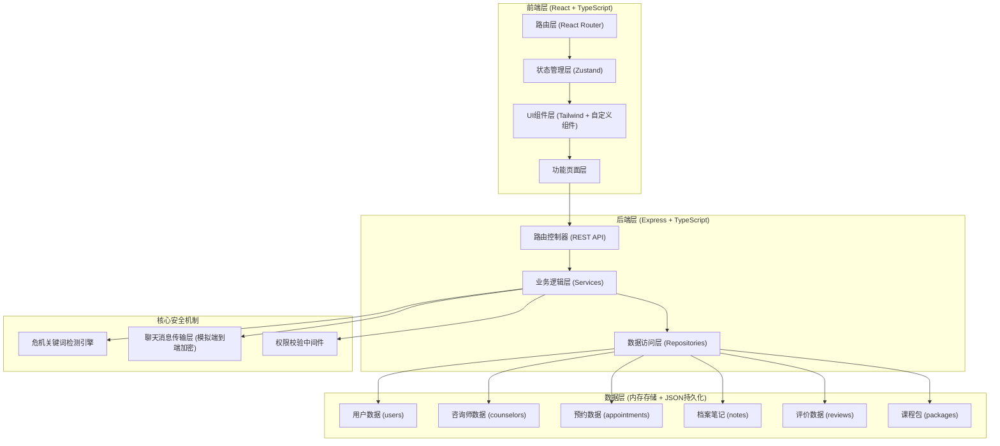
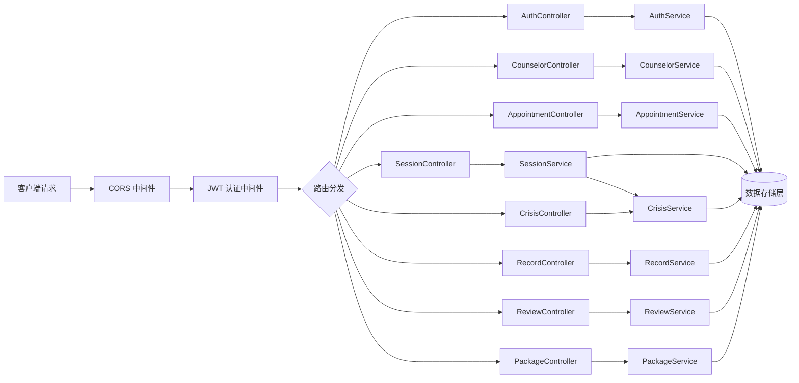
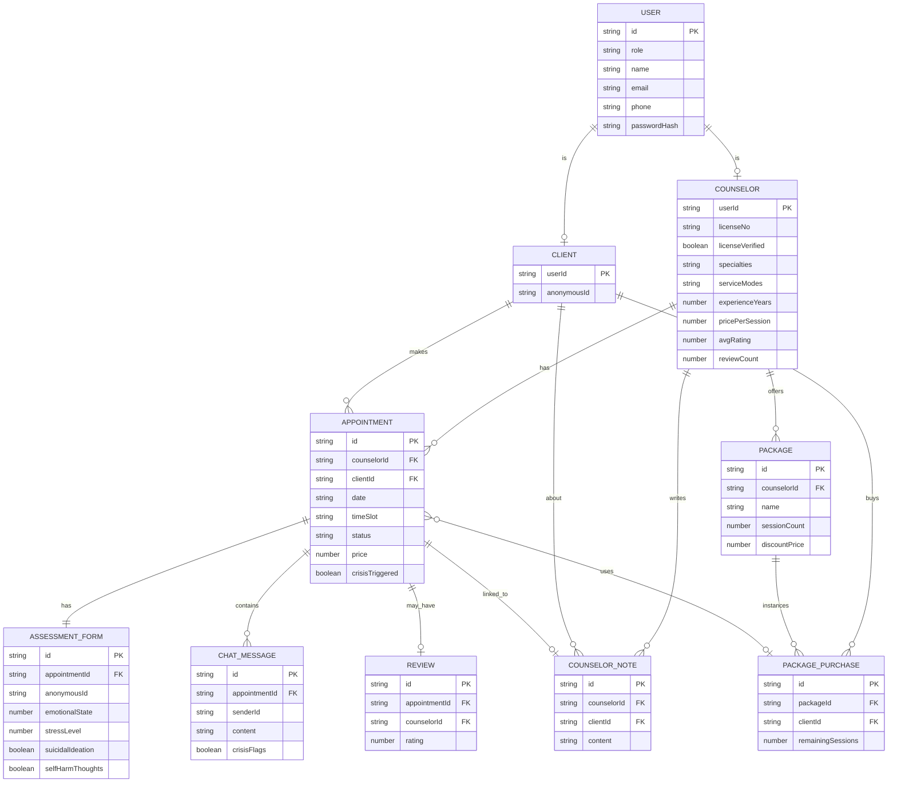

## 1. 架构设计



## 2. 技术说明

- **前端**：React@18 + TypeScript + Vite@5 + Tailwind CSS@3 + Zustand@4 + React Router@6 + Lucide React
- **初始化工具**：vite-init (react-express-ts 模板)
- **后端**：Express@4 + TypeScript + CORS
- **数据库**：内存数据存储 + JSON 文件持久化（模拟生产级数据库行为，便于演示）
- **实时通信**：前端轮询模拟实时聊天（演示模式，生产可替换 Socket.io）

## 3. 路由定义

### 前端路由

| 路由路径 | 页面用途 | 访问权限 |
|----------|----------|----------|
| `/` | 首页 - 咨询师列表与筛选 | 公开 |
| `/counselor/:id` | 咨询师详情页 | 公开 |
| `/login` | 登录页（双角色） | 公开 |
| `/register` | 注册页（选择角色） | 公开 |
| `/register/client` | 来访者注册 | 公开 |
| `/register/counselor` | 咨询师注册（资质上传） | 公开 |
| `/booking/:counselorId` | 预约流程页（含问卷） | 来访者 |
| `/session/:appointmentId` | 咨询会话页（安全聊天） | 双方 |
| `/client/dashboard` | 来访者中心 - 我的预约 | 来访者 |
| `/client/packages` | 来访者中心 - 课程包管理 | 来访者 |
| `/client/reviews` | 来访者中心 - 评价管理 | 来访者 |
| `/counselor/dashboard` | 咨询师后台 - 预约管理 | 咨询师 |
| `/counselor/profile` | 咨询师后台 - 执业信息编辑 | 咨询师 |
| `/counselor/schedule` | 咨询师后台 - 时段设置 | 咨询师 |
| `/counselor/records` | 咨询师后台 - 档案管理 | 咨询师 |

### 后端 API 路由

| Method | Route | 用途 |
|--------|-------|------|
| POST | `/api/auth/login` | 用户登录 |
| POST | `/api/auth/register/client` | 来访者注册 |
| POST | `/api/auth/register/counselor` | 咨询师注册 |
| GET | `/api/counselors` | 获取咨询师列表（支持筛选） |
| GET | `/api/counselors/:id` | 获取咨询师详情 |
| GET | `/api/counselors/:id/schedule` | 获取咨询师可预约时段 |
| POST | `/api/appointments` | 创建预约（含问卷提交） |
| GET | `/api/appointments/mine` | 获取我的预约（按角色） |
| PATCH | `/api/appointments/:id/status` | 更新预约状态 |
| POST | `/api/sessions/:appointmentId/messages` | 发送聊天消息 |
| GET | `/api/sessions/:appointmentId/messages` | 获取聊天消息（模拟） |
| POST | `/api/crisis/check` | 检测消息中的危机关键词 |
| POST | `/api/records` | 咨询师创建工作笔记 |
| GET | `/api/records/client/:clientId` | 获取某来访者的笔记列表 |
| POST | `/api/reviews` | 来访者提交评价（仅评分） |
| GET | `/api/reviews/counselor/:counselorId` | 获取咨询师评分统计 |
| GET | `/api/packages/:counselorId` | 获取咨询师课程包 |
| POST | `/api/packages/:packageId/purchase` | 购买课程包 |
| GET | `/api/packages/mine` | 获取我的课程包 |
| GET | `/api/counselor/me/profile` | 获取咨询师本人执业信息 |
| PUT | `/api/counselor/me/profile` | 更新咨询师执业信息 |
| PUT | `/api/counselor/me/schedule` | 更新咨询师时段设置 |

## 4. API 类型定义

```typescript
// ============ 用户相关 ============
type UserRole = 'client' | 'counselor';

interface User {
  id: string;
  role: UserRole;
  phone?: string;
  email?: string;
  name: string;
  avatar?: string;
  passwordHash: string;
  createdAt: string;
}

interface Client extends User {
  role: 'client';
  anonymousId: string; // 匿名ID，用于问卷关联
}

interface Counselor extends User {
  role: 'counselor';
  licenseNo: string;
  licenseVerified: boolean;
  specialties: Specialty[];
  serviceModes: ServiceMode[];
  introduction: string;
  education: string;
  experienceYears: number;
  sessionDuration: number; // 单次时长(分钟)
  pricePerSession: number;
  avgRating: number;
  reviewCount: number;
  totalSessions: number;
}

type Specialty = 'anxiety' | 'depression' | 'marriage' | 'adolescent' | 'trauma' | 'stress' | 'family' | 'other';
type ServiceMode = 'text' | 'voice' | 'video';

// ============ 预约相关 ============
type AppointmentStatus = 'pending' | 'confirmed' | 'cancelled' | 'completed' | 'in_progress';

interface Appointment {
  id: string;
  counselorId: string;
  clientId: string;
  date: string; // YYYY-MM-DD
  timeSlot: string; // HH:mm-HH:mm
  serviceMode: ServiceMode;
  status: AppointmentStatus;
  price: number;
  packageUsageId?: string;
  assessmentForm?: AssessmentForm;
  crisisTriggered: boolean;
  createdAt: string;
}

interface AssessmentForm {
  anonymousId: string;
  emotionalState: number; // 1-10
  stressLevel: number; // 1-10
  sleepQuality: number; // 1-10
  mainConcern: string;
  durationMonths: number;
  previousTherapy: boolean;
  previousTherapyDetails?: string;
  suicidalIdeation: boolean;
  selfHarmThoughts: boolean;
  additionalNotes?: string;
  submittedAt: string;
}

// ============ 聊天与会话 ============
interface ChatMessage {
  id: string;
  appointmentId: string;
  senderId: string;
  senderRole: UserRole;
  content: string;
  contentEncrypted: boolean;
  timestamp: string;
  crisisFlags?: string[]; // 命中的危机关键词
}

// ============ 档案笔记 ============
interface CounselorNote {
  id: string;
  counselorId: string;
  clientId: string;
  appointmentId?: string;
  content: string;
  tags: string[];
  createdAt: string;
  updatedAt: string;
}

// ============ 评价 ============
interface Review {
  id: string;
  appointmentId: string;
  counselorId: string;
  clientId: string;
  rating: number; // 1-5
  createdAt: string;
  // 文字内容不存储，保护隐私
}

// ============ 课程包 ============
interface Package {
  id: string;
  counselorId: string;
  name: string; // '6次咨询包' | '12次咨询包'
  sessionCount: number;
  originalPrice: number;
  discountPrice: number;
  description: string;
}

interface PackagePurchase {
  id: string;
  packageId: string;
  clientId: string;
  counselorId: string;
  remainingSessions: number;
  totalSessions: number;
  purchasedAt: string;
  expireAt: string;
}
```

## 5. 服务器架构图



## 6. 数据模型

### 6.1 ER 图



### 6.2 初始数据 (Mock Data)

平台将预置以下演示数据：

1. **咨询师账号（3-5人）**：涵盖不同擅长方向（焦虑、抑郁、婚姻、青少年），已通过资质审核，设置好时段与价格
2. **来访者账号（2人）**：可用于预约体验
3. **预约示例数据**：含已完成/进行中/待确认等多种状态
4. **危机关键词库**：自杀、自残、想死、结束生命、不想活、割腕、跳楼等约30+高危词汇
5. **课程包数据**：每位咨询师配置6次包（约9折）和12次包（约8折）
6. **评价数据**：已完成咨询有对应评分，用于展示评分分布统计
